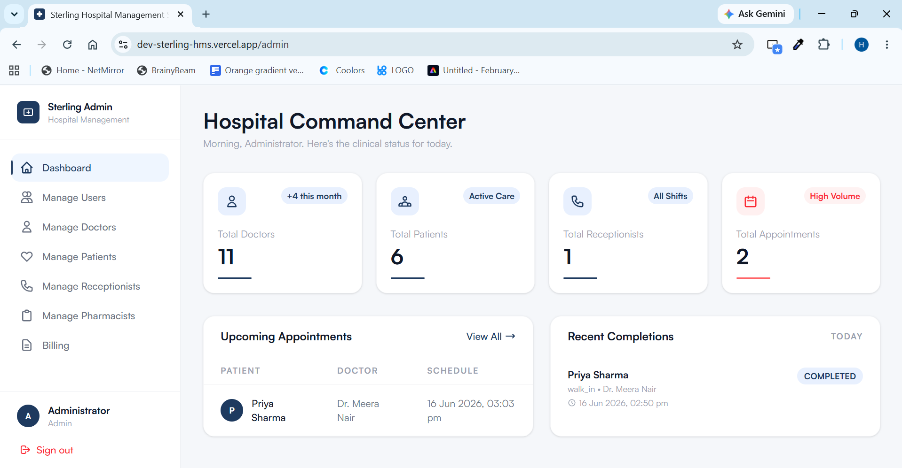
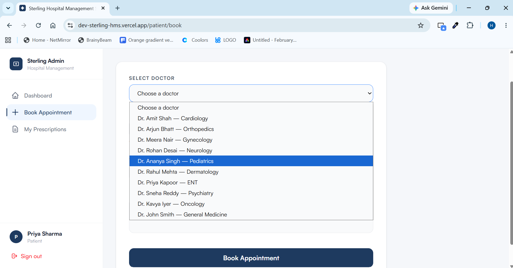
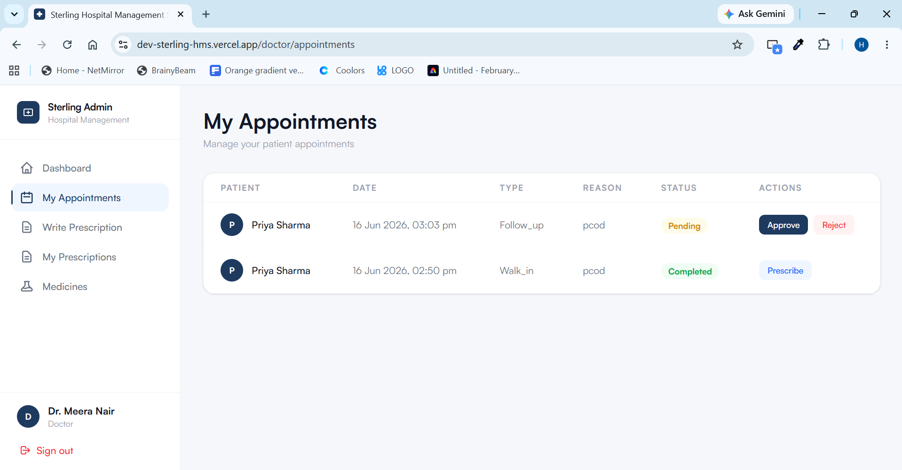
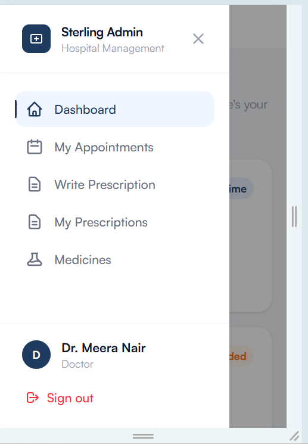

# Sterling HMS — Hospital Management System

A full-stack hospital management system built to handle the real day-to-day workflow of a clinic: booking appointments, managing patients and staff, writing and dispensing prescriptions, and billing — across five distinct user roles.

**Live demo:** https://dev-sterling-hms.vercel.app
**Backend API:** https://sterling-hms-backend.onrender.com

> Demo credentials available on request, or sign up is open via the Admin → Manage Users flow once logged in as an admin.

---

## Screenshots






---

## Overview

Sterling HMS models a real hospital's operational flow with **five role-based dashboards**, each scoped to exactly what that role needs:

| Role             | Capabilities                                                                                                         |
| ---------------- | -------------------------------------------------------------------------------------------------------------------- |
| **Admin**        | Manage all users (doctors, patients, receptionists, pharmacists), view billing, mark payments, download PDF receipts |
| **Doctor**       | View/approve/reject/complete appointments, write prescriptions, view prescription history, browse medicine catalog   |
| **Patient**      | Book appointments, view appointment status, view prescriptions and dispense status                                   |
| **Receptionist** | Book appointments on behalf of patients, manage the full appointment queue                                           |
| **Pharmacist**   | View incoming prescriptions, dispense medicines, manage medicine inventory                                           |

The full lifecycle is connected end-to-end:
**Patient books → Doctor approves → Doctor completes → Doctor prescribes → Pharmacist dispenses → Billing record auto-created → Admin marks paid → PDF receipt generated.**

---

## Tech Stack

**Frontend**

- Vue 3 (Composition API) + Vite
- Tailwind CSS
- Pinia (state management)
- Vue Router
- jsPDF (client-side PDF receipt generation)
- Deployed on **Vercel**

**Backend**

- Go (Gin framework)
- JWT authentication with role-based middleware
- sqlx for database access
- Deployed on **Render**

**Database**

- PostgreSQL via **Supabase** (Transaction Pooler connection)

---

## Architecture Notes

A few things worth highlighting from how this was built:

- **Role-based route guards** on both frontend (Vue Router meta fields) and backend (Gin middleware), so every endpoint and every page checks permissions independently — not just hiding UI elements.
- **Responsive design** from scratch: a collapsible sidebar drawer on mobile/tablet, with every dashboard, table, and modal individually adapted for small screens.
- **Auto-billing on dispense**: when a pharmacist dispenses a prescription, a billing record is created automatically — no manual admin entry required.
- **Defensive data handling**: API responses are guarded against `null`/empty arrays throughout the frontend to avoid runtime crashes on first-time or edge-case data states.

### Bugs fixed during development worth mentioning

- Diagnosed and permanently resolved a Postgres `jsonb` column type causing silent 500s on `GET /doctors` (fixed at the schema level rather than patching around it).
- Fixed an auth persistence bug where Pinia's reactivity wasn't syncing with `localStorage` across page navigations, causing login to silently fail to redirect.
- Resolved a backend/database schema mismatch in the billing module by aligning the Go model, repository queries, and Supabase schema.

---

## Running Locally

**Backend**

```bash
cd backend
go run ./cmd/main.go
```

Requires a `.env` with `DATABASE_URL` (Supabase pooler connection string) and `PORT`.

**Frontend**

```bash
cd frontend
npm install
npm run dev
```

Local development proxies `/api` to `localhost:8080` via `vite.config.js` — no environment variables needed for local dev. Production uses a Vercel rewrite (`vercel.json`) to proxy to the Render backend.

---

## A Note on Process

This project was built with significant assistance from Claude (Anthropic), used as a pair-programming and debugging partner throughout — from initial feature builds through systematic production debugging (database connection issues, schema mismatches, auth bugs) to a full responsive design pass. The architecture decisions, trade-offs, and final implementation choices were directed and reviewed throughout the build.

---

## License

Personal/portfolio project.
